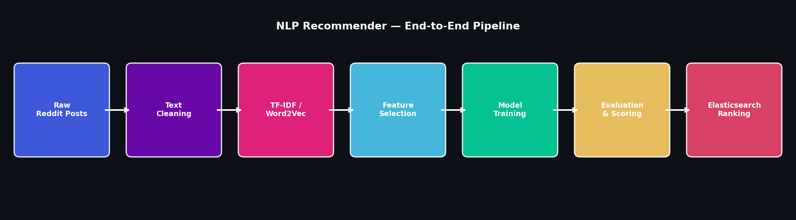
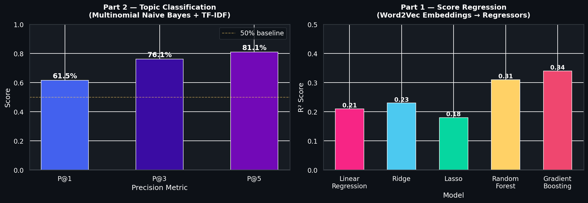
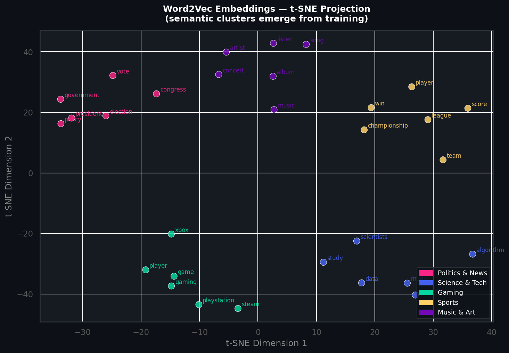
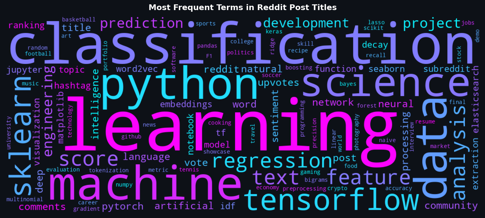
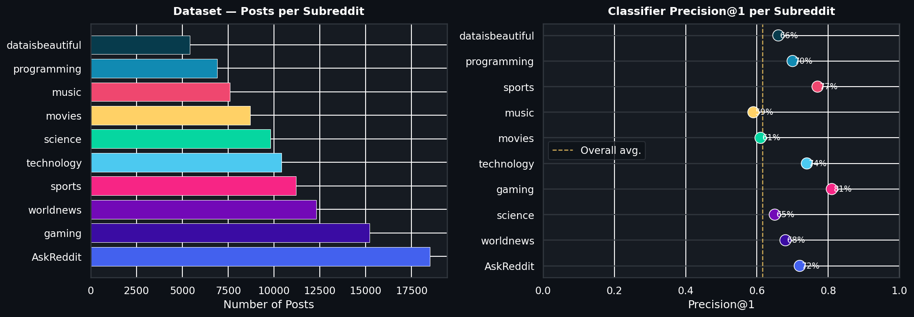

# Intelligent Recommender System Based on Textual Content

<p align="center">
  
</p>

<p align="center">
  
  
  
  
  
  
</p>

> **Final project for NYU Tandon School of Engineering.**  
> An NLP-based recommender pipeline that (1) predicts how many upvotes a Reddit post will receive and (2) classifies its topic — designed to power real-time feed ranking via Elasticsearch decay scoring for the **Xloosv** platform.

---

## Overview

| | Part 1 — Score Prediction | Part 2 — Topic Classification |
|---|---|---|
| **Goal** | Predict upvote count from title text | Classify post into subreddit/topic |
| **Features** | Word2Vec embeddings (custom + pre-trained) | TF-IDF (unigrams + bigrams) |
| **Models** | Linear, Ridge, Lasso, Random Forest, Gradient Boosting | Multinomial Naive Bayes |
| **Dataset** | ~190,000 Reddit posts | ~1,013,000 Reddit posts |
| **Best result** | R² = 0.34 (Gradient Boosting) | Precision@5 = **81%** |

---

## Results

### Part 2 — Topic Classification Performance

<p align="center">
  
</p>

| Metric | Score |
|--------|-------|
| Precision@1 | **61.5%** |
| Precision@3 | **76.2%** |
| Precision@5 | **81.1%** |

> *Predicting the correct subreddit from raw title text, choosing from 1,000+ categories.*

### Semantic Structure — Word2Vec Embeddings

<p align="center">
  
</p>

Words with related meaning cluster together in 300-dimensional embedding space — no labels used during training.

---

## Vocabulary & Most Frequent Terms

<p align="center">
  
</p>

---

## Dataset Distribution

<p align="center">
  
</p>

---

## Architecture

```
Raw Reddit Posts
      │
      ▼
 Text Cleaning
 ─ lowercase, strip punctuation
 ─ remove stopwords (optional)
 ─ bigram detection (Gensim Phrases)
      │
      ├──────────────────────────────────────────────┐
      │                                              │
      ▼                                              ▼
 Part 1: Score Prediction                  Part 2: Topic Classification
 ─ Average Word2Vec (300-d)                ─ TF-IDF (30k features, 1–2 grams)
 ─ Custom + GloVe pre-trained              ─ Chi-squared feature selection
 ─ Multiple regressors                     ─ Multinomial Naive Bayes
 ─ Train/test split                        ─ Precision@k evaluation
      │                                              │
      └──────────────┬───────────────────────────────┘
                     │
                     ▼
          NLP Score stored per post
                     │
                     ▼
          Elasticsearch Decay Function
          ─ Weighted by: creation_date
                         num_likes
                         num_comments
                         NLP score
                     │
                     ▼
           Top-10 Post Feed (Xloosv)
```

---

## Notebooks

| Notebook | Description |
|----------|-------------|
| [`demo.ipynb`](demo.ipynb) | **Start here** — self-contained demo with synthetic data, full pipeline, all visualizations |
| [`Part 1 - Predict Score.ipynb`](Part%201%20-%20Predict%20Score.ipynb) | Full Word2Vec training + regression on 190k posts |
| [`Part 2 - Predict Topic.ipynb`](Part%202%20-%20Predict%20Topic.ipynb) | TF-IDF + Naive Bayes classification on 1M posts |

---

## Quickstart

```bash
# 1. Clone the repo
git clone https://github.com/<your-username>/<this-repo>.git
cd <this-repo>

# 2. Install dependencies
pip install -r requirements.txt

# 3. Run the self-contained demo (no dataset required)
jupyter notebook demo.ipynb

# 4. For the full notebooks, download the datasets:
#    Part 1: https://www.kaggle.com/datasets/...
#    Part 2: https://github.com/umbrae/reddit-top-2.5-million/
```

---

## Datasets

| Dataset | Source | Size |
|---------|--------|------|
| Reddit Posts (Part 1) | [Kaggle — dataisbeautiful](https://www.kaggle.com/unanimad/dataisbeautiful) | ~190k rows |
| Reddit Posts + Subreddits (Part 2) | [reddit-top-2.5-million](https://github.com/umbrae/reddit-top-2.5-million/) | ~1M rows |

> The original notebooks mount these from Google Drive. Replace the path cells with your local file paths when running locally.

---

## Tech Stack

| Layer | Tools |
|-------|-------|
| Language | Python 3.11 |
| Data | NumPy, pandas |
| NLP | NLTK, Gensim (Word2Vec, Phrases), scikit-learn (TF-IDF) |
| Models | scikit-learn regressors + MultinomialNB, TensorFlow |
| Visualization | Matplotlib, Seaborn, WordCloud |
| Notebook | Jupyter |
| Target platform | Elasticsearch (decay ranking), Firebase ML |

---

## Project Motivation

The Xloosv app is a private student communication platform. To surface the most engaging content, we need a way to rank posts before they accumulate votes. This project trains NLP models on Reddit as a proxy dataset (large-scale labeled social posts), then exports the learned scoring function as a portable model that feeds directly into Elasticsearch's decay scoring formula.

---

<p align="center">Made with 💙 at <strong>NYU Tandon School of Engineering</strong></p>
